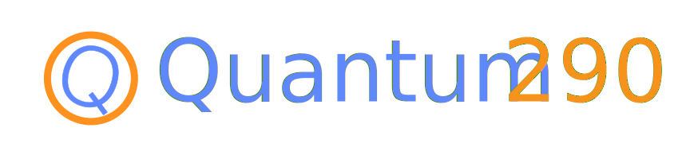

----------------------------
### 🌟 Math 290 Quantum many-body seminar

- **When:** 🕒 Friday 1PM-3PM 
- **Where:** Evans 891
- **Moderator**: **Zhen Huang and Raehyun Kim**

## 📌 Schedule (2025 Spring) 

🆕✨🔨: [**BOOK the slot for NEW semester!**](mailto:hertz@berkeley.edu), [UCB calendar](http://guide.berkeley.edu/academic-calendar/) 

| # | Date | Topic                                                          | Speaker     | References                                                                                                      |
|---|------|----------------------------------------------------------------|-------------|-----------------------------------------------------------------------------------------------------------------|
| 1 | 1/17  | 1.6 | Michael Ragone | [Notes](asset/2025Spring/Quantum_Channels_1.pdf) |
| 2 | 1/24  | 1.6 | Michael Ragone | [Notes](asset/2025Spring/Quantum_Channels_2.pdf) |
| 3 | 1/31 | 2.1 | Sergio | [Notes](asset/2025Spring/Lec3.pdf) |
| 4 | 2/14 | QIP prep talks | Joao Basso, Jiaqi Leng, Lin Lin | |
| 5 | 2/21 | | (May be canceled) | |
| 6 | 3/7 | 2.2 | Joao Basso | |
| 7 | 3/21 | 6.2 | Zhiyan Ding | [Notes](asset/2025Spring/Zhiyan_lecture_notes.pdf)|
| 8 | 4/4 |   | (canceled) | |
| 9 | 4/11 | 6.4 | Zherui Chen | |
| 10 | 4/17 | 7.1.1 | Rahul Sakar |[Notes](asset/2025Spring/semigroup-notes.pdf) |
| 11 | 4/25 | 7.1.2 | Joao Basso | [Notes](asset/2025Spring/Quantum_Semigroups.pdf)|
| 12 | 5/2 | |Zherui Chen, Jiaqi Leng
  | |
| 13 | 5/9 | | | |

### Reading materials

**[Wol12]** Wolf, M. M. (2012). Quantum Channels & Operations Guided Tour.  [pdf](https://citeseerx.ist.psu.edu/document?repid=rep1&type=pdf&doi=afa58291b0b8bd47504acb1ab8f553f0b37685cf)

The following list is provided by **Michael Ragone** and may be revised during the semester.

1. Section 1.6: C* algebra language, spectrum, positivity
2. Section 1.6 continued: Von Neumann algebras and conditional expectation. 
3. Section 2.1: Jamiołkowski and Choi, start Section 2.2
4. Section 2.2: Kraus representation and Stinespring dilations
5. Section 5.1
6. Section 5.2: (It would be nice to have section 5.3, but this probably fits more naturally after we have reached open quantum systems.)
7. Section 6.1
8. Section 6.2, part I 
9. Section 6.2, part II 
10. Section 6.3
11. Section 6.4
12. Section 6.5
13. Section 7.1.1
14. Section 7.1.2, part I
15. Section 7.1.2, part II

<!--

- Ch 2.1-2.4
- Ch 3.1-3.3
- Ch 6-6.1
- Ch 6.2-6.3
- Ch 6.4-6.5
- Ch 7.1
- Ch 8.1-8.3
- Ch 8.4-8.7
-->

----------------------------
### 🌟 Math 290 Quantum many-body seminar -- Computational

- **When:** 🕒 Monday 4PM-5PM 
- **Where:** Evans 891
- **Moderator**: **Zhen Huang and Raehyun Kim**

## 📌 Schedule (2025 Spring) 

🆕✨🔨: [**BOOK the slot for NEW semester!**](mailto:hertz@berkeley.edu), [UCB calendar](http://guide.berkeley.edu/academic-calendar/) 

| # | Date | Topic                                                          | Speaker     | References                                                                                                      |
|---|------|----------------------------------------------------------------|-------------|-----------------------------------------------------------------------------------------------------------------|
| 1 | 1/13  |  | Yuanran Zhu /  Gil Goldshlager  | |
| 2 | 1/27  |  | Stephene Quiton / Raehyun Kim |  |
| 3 | 2/3 |  | Jiang Hu | |
| 4 | 2/11 |  | (Canceled) | |
| 5 | 3/3 |  | Avijit Shee / Zhen | |
| 6 | 3/17 | | Go Around | |
| 7 | 3/24 | | Spring Break | |
| 8 | 3/31 | | | |
| 9 | 4/7 | | | |

### 📃 Previous Schedules 

Schedule (2024 Summer and Fall)

| # | Date | Topic                                                          | Speaker     | References                                                                                                      |
|---|------|----------------------------------------------------------------|-------------|-----------------------------------------------------------------------------------------------------------------|
| 1 | 7/29  | Review of recent backgrounds and perspectives on open quantum systems. | Lin Lin |  |
| 2 | 8/2  | Review of recent projects | All    |                                                                                                                 |
| 3 | 8/5  | Quasi-free systems |    |                                                                                                                 |
| 4 | 8/19 | Quantum walks |   Xinzhao Wang  |    [Paper](http://gilyen.hu/papers/STOC21SubExpStoqAdiabatic.pdf)                                                                                                           |
| 5 | 8/30 | Quantum states | Michael Ragone |[Notes](asset/2024Fall/Ragone_2024_08_30.pdf) |
| 6 | 9/6  | Quantum states (continued) | Michael Ragone | [Notes](asset/2024Fall/Ragone_2024_09_06.pdf), [Ref 1](https://nextcloud.tfk.ph.tum.de/etn/wp-content/uploads/2022/09/JvN_lecture_notes_S2016_abcde-1.pdf), [Ref 2](https://arxiv.org/abs/1311.2717), and [Ref 3, Chap 2 & 3](https://link.springer.com/book/10.1007/b128449)|
|7| 9/20 |Mixing time of the Swendsen-Wang algorithm| Ruizhe Zhang||
|8| 9/27 |On quantum signal processing|Yulong Dong||
|9|10/4|Applied Math Approaches to Condensed Matter Physics|Kevin Stubbs||
|10|11/1|Accelerating Langevin sampling via Lindblad dynamics|Jiaqi Leng||
|11|11/8|A brief introduction to overdamped Langevin dynamics for continuous sampling: convergence analysis for continuous dynamics and discretization algorithm|Zhiyan Ding ||
|12|11/15|On quantum error correction|Sergio Escobar||
|13|11/22|Some momentum-type methods in optimization with orthogonality constraints|Jiang Hu||
|14|12/6||Kevin Stubbs||
|15|12/13||Rahul Sarkar||

## Reading materials
<strong> Open quantum systems and mixing times</strong>
1. Ilin, Y., & Arad, I. (2024). Dissipative variational quantum algorithms for Gibbs state preparation. [arxiv](http://arxiv.org/abs/2407.09635)
2. Araujo de Resende, M. F. (2020). A pedagogical overview on 2D and 3D Toric Codes and the origin of their topological orders. [Reviews in Mathematical Physics, 32(02), 2030002](https://doi.org/10.1142/S0129055X20300022)
3. Temme, K., Pastawski, F., & Kastoryano, M. J. (2014). Hypercontractivity of quasi-free quantum semigroups. [Journal of Physics A: Mathematical and Theoretical, 47(40), 1–26.](https://doi.org/10.1088/1751-8113/47/40/405303)
4. Funo, K., & Ishizaki, A. (2024). Dynamics of a Quantum System Interacting with White Non-Gaussian Baths: Poisson Noise Master Equation. [Physical Review Letters, 132(17), 1–12.](https://journals.aps.org/prl/abstract/10.1103/PhysRevLett.132.170402)
5. Guo, H., & Jerrum, M. (2018). Random cluster dynamics for the ising model is rapidly mixing. [Annals of Applied Probability, 28(2), 1292–1313.](https://doi.org/10.1214/17-AAP1335)
6. Jerrum, M., & Sinclair, A. (1993). Polynomial-Time Approximation Algorithms for the Ising Model. [SIAM Journal on Computing, 22(5), 1087–1116.](https://doi.org/10.1137/0222066)
7. Somma, R. D., King, R., Kothari, R., O’Brien, T., & Babbush, R. (2024). Shadow Hamiltonian Simulation. [arxiv]( http://arxiv.org/abs/2407.21775)

<h4>Some previous reading materials</h4>
<strong>Quantum control</strong>: He, W., Li, T., Li, X., Li, Z., Wang, C., & Wang, K. (2024). [Efficient Optimal Control of Open Quantum Systems](http://arxiv.org/abs/2405.19245). 

<strong>Quantum walk</strong> Gilyén, A., Hastings, M. B., & Vazirani, U. (2021). [(Sub)Exponential advantage of adiabatic Quantum computation with no sign problem](https://doi.org/10.1145/3406325.3451060). 

<strong>Adiabatic algorithm</strong> Somma, R. D., Nagaj, D., & Kieferová, M. (2012). [Quantum speedup by quantum annealing](https://doi.org/10.1103/PhysRevLett.109.050501).

<strong> Completely bounded maps </strong> [Chapter 8]( https://www.cambridge.org/core/services/aop-cambridge-core/content/view/0E3AFAE3A777B[…]/9780511546631c8_p97-119_CBO.pdf/completely_bounded_maps.pdf) of *Completely bounded maps and operator algebras*.

<strong> Metropolis sampling </strong> Jiang, J., & Irani, S. (2024). [Quantum Metropolis Sampling via Weak Measurement](http://arxiv.org/abs/2406.16023). 

<strong> Non-Markovian dynamics </strong> Li, X. (2021) [Markovian embedding procedures for non-Markovian stochastic Schrödinger equations]( https://doi.org/10.1016/j.physleta.2020.127036)

Schedule (2024 Spring)

| # | Date | Topic                                                          | Speaker     | References                                                                                                      |
|---|------|----------------------------------------------------------------|-------------|-----------------------------------------------------------------------------------------------------------------|
| 1 | 1/26  | Lindblad equation and Davies generator | Lin Lin | [**Lindblad Notes**](asset/Lindblad_Notes.pdf) |
| 2 | 2/2  | Quantum detailed balance and mixing | Lin Lin    |                                                                                                                 |
| 3 | 2/9  | Hybrid hierarchical equation of motion for open quantum systems|  Yuanran Zhu   |   [**Hybrid HEOM Notes**](asset/Hybrid_HEOM_for_open_quantum_systems.pdf)                      |
| 4 | 2/16  |   Solving quasi-free systems        |  Zhen Huang   |    [**Notes**](asset/lindbladnotes_0216.pdf)                                                                                 |
| 5 | 2/23  | How to represent a quantum bath for Tensor Network simulation?  |  Gunhee Park   | [**Quantum Bath for TN PPT**](asset/Quantum290_GunheePark.pdf)   |
| 6 | 3/1  |     March Meeting Prep      | |                                                                                                                 |
| 7 | 3/8  |    open system dynamics via influence functionals        |   Erika Ye   |   [**Influence Functional Notes**](asset/20240308_QI_seminar.pdf)    |
| 8 | 3/15  | Introduction to HEOM |    Avijit Shee |                                                                                                                 |
| 9 | 3/22  |           |  No seminar    |                                                                                                                 |
| 10 | 3/29  |  |  No seminar  |                                                                                                       |
| 11 | 4/5  |           |  No seminar   |                                                                                                                 |
| 12 | 4/12  |    Lower bounds to the spectral gap of Davies generators       |  Kevin Stubbs   |  [**Spectral Gap of Davis Operator Notes**](asset/math_290_lindblad.pdf)                                                                                                               |
| 13 | 4/19  |           |  No seminar   |                                                                                                                 |
| 14 | 4/26  |   Quantum Gibbs Samplers: the commuting case        |  Zhiyan Ding   |                                                                     |
| 15 | 5/3  |           |  Gil Goldshlager   |                                                                                                                 |
## Reading materials 

#### Derivation of Lindblad dynamics and non-Markovian systems
1. Lidar, D. A. (n.d.). Lecture Notes on the Theory of Open Quantum Systems. arXiv:1902.00967 Chap VIII-X
2. De Vega, I., & Alonso, D. (2017). Dynamics of non-Markovian open quantum systems. Reviews of Modern Physics, 89(1), 1–58. https://doi.org/10.1103/RevModPhys.89.015001 Sec III-IV
#### Exactly solvable Linear-Quadratic open quantum systems.
1. Dzhioev, A. A., & Kosov, D. S. (2011). Super-fermion representation of quantum kinetic equations for the electron transport problem. Journal of Chemical Physics, 134(4), 1–18. https://doi.org/10.1063/1.354806
2. Barthel, T., & Zhang, Y. (2022). Solving quasi-free and quadratic Lindblad master equations for open fermionic and bosonic systems. Journal of Statistical Mechanics: Theory and Experiment, 2022(11). https://doi.org/10.1088/1742-5468/ac8e5c
3. Cirio, M., Lambert, N., Liang, P., Kuo, P., Chen, Y., Menczel, P., Funo, K., & Nori, F. (2023). Pseudofermion method for the exact description of fermionic environments : From single-molecule electronics to the Kondo resonance. 033011, 1–16. https://doi.org/10.1103/PhysRevResearch.5.033011
4. Dorda, A., Ganahl, M., Evertz, H. G., Von Der Linden, W., & Arrigoni, E. (2015). Auxiliary master equation approach within matrix product states: Spectral properties of the nonequilibrium Anderson impurity model. Physical Review B - Condensed Matter and Materials Physics, 92(12), 68–70. https://doi.org/10.1103/PhysRevB.92.125145 Sec. E
#### Hierarchical equation of motion and influence functional approaches, Bosonic / Fermionic bath reduction
1. Fay, T. P., & Limmer, D. T. (2022). Coupled charge and energy transfer dynamics in light harvesting complexes from a hybrid hierarchical equations of motion approach. Journal of Chemical Physics, 157(17). https://doi.org/10.1063/5.0117659
2. Ye, E., & Chan, G. K. (2021). Constructing Tensor Network Influence Functionals for General Quantum Dynamics. 1–14.
3. Woods, M. P., Groux, R., Chin, A. W., Huelga, S. F., & Plenio, M. B. (2014). Mappings of open quantum systems onto chain representations and Markovian embeddings. Journal of Mathematical Physics, 55(3), 1–48. https://doi.org/10.1063/1.4866769
4. Nüßeler, A., Dhand, I., Huelga, S. F., & Plenio, M. B. (2020). Efficient simulation of open quantum systems coupled to a fermionic bath. Physical Review B, 101(15), 1–20. https://doi.org/10.1103/PhysRevB.101.155134
5. Selstø, S. (n.d.). Absorbing boundary conditions for dynamical many-body quantum systems. 1–16. https://iopscience.iop.org/article/10.1088/0953-4075/43/6/065004
#### Ergodicity, quantum detailed balance, mixing time.
1. Zhang, Y., & Barthel, T. (2023). Criteria for Davies Irreducibility of Markovian Quantum Dynamics. 1–20. http://arxiv.org/abs/2310.17641
2. Wocjan, P., & Temme, K. (2023). Szegedy Walk Unitaries for Quantum Maps. Communications in Mathematical Physics, 402(3), 3201–3231. https://doi.org/10.1007/s00220-023-04797-4 Sec 1-2.
3. Temme, K. (2014). Lower bounds to the spectral gap of Davies generators https://arxiv.org/abs/1305.5591
4. Spohn, H., An algebraic condition for the approach to equilibrium of an open N-level system

Schedule (2023 Fall)

| # | Date | Topic                                                          | Speaker     | References                                                                                                      |
|---|------|----------------------------------------------------------------|-------------|-----------------------------------------------------------------------------------------------------------------|
| 1 | 9/1  |    Quantum embedding based on coupled cluster theory           | Avijit Shee |                                                                                                                 |
| 2 | 9/8  |       The Ferromagnetic Ground State of Spinless, Valleyless Twisted Bilayer Graphene                        |    Kevin Stubbs |                                                                                                                 |
| 3 | 9/29 (cancelled) |                       |       |                                                                                                         |
| 4 | 10/13 (zoom) |        A class of signal processing method                 |    Zhiyan Ding         |   [paper1]( https://ieeexplore.ieee.org/abstract/document/9000636), [paper2](https://arxiv.org/abs/1408.1681)                                                                                                            |
| 5 | 11/3 | Hybridization expansion approach to quantum impurites in the strong-coupling regime         | Zhen Huang  |   [paper](https://journals.aps.org/prb/pdf/10.1103/PhysRevB.82.115115)                                                                                                       |
| 6 | 11/17|     Diffusion models: a concise but comprehensive introduction    |    Yulong Dong         |   [paper1](https://arxiv.org/abs/2011.13456), [paper2](https://proceedings.neurips.cc/paper/2020/hash/4c5bcfec8584af0d967f1ab10179ca4b-Abstract.html)                                                                                                              |
| 7 | 12/1 |           TBD                                                  |  Nilin Abrahamsen  |                                                                                                                 |
| 8 | 12/8 |   Projected Hartree Fock        |  Raehyun Kim  |                                                                                                                 |

Schedule (2023 Summer)

| # | Date | Topic                                                          | Speaker     | References                                                                                                      |
|---|------|----------------------------------------------------------------|-------------|-----------------------------------------------------------------------------------------------------------------|
| 1 | 5/5  | Green’s function methods: Theory and application to GW and GF2 | Zhen Huang  | [paper](https://pubs.aip.org/aip/jcp/article/155/2/024119/1065035/Evaluation-of-two-particle-properties-within) |
| 2 | 5/12 | Electron-phonon interactions from first principles             | Yuanran Zhu | [paper](http://journals.aps.org/rmp/abstract/10.1103/RevModPhys.89.015003)                                     |
| 3 | 6/9  | Quantics tensor train                                          | Nilin Abrahamsen | [paper](https://epubs.siam.org/doi/10.1137/100811647)                                                         |
| 4 | 6/16 |                                                                |             |                                                                                                                 |
| 5 | 6/23 | TBD                                                               | Avijit Shee |                                                                                                                 |
| 6 | 7/7  | quantum sampling                                       |  Jin-Peng Liu            |    [paper](http://journals.aps.org/pra/abstract/10.1103/PhysRevA.78.042336)                                  |

Schedule (2023 Spring)

| #   | Date | Topic                                                                                      | Speaker                  | References                               |
|-----|------|--------------------------------------------------------------------------------------------|--------------------------|------------------------------------------|
| 1   | 1/13 | Quantum signal processing, and some structure theorems of the qudit Pauli group            | Rahul Sakar (Stanford)   |                                          |
| 1'  | 1/17 | Efficient and robust learning of fermionic reduced density matrices with classical shadows | Andrew Zhao (New Mexico) |                                          |
| 1'' | 1/20 | Strong correlations in quantum chemistry: numerical analysis and recent applications       | Fabian Faulstich         |                                          |
| 2   | 1/27 | ~Algorithms for Clifford stabilizer simulations~                                           | ~Sajant Anand~           | ~https://arxiv.org/abs/quant-ph/0406196~ |
| 3   | 2/3  | Algorithms for Clifford stabilizer simulations                                             | Sajant Anand             | https://arxiv.org/abs/quant-ph/0406196   |
| 4   | 2/24 | Towards Neural Variational Monte Carlo That Scales Linearly with System Size               | Nilin                    | http://arxiv.org/abs/2212.11296          |
| 5   | 3/3  | Hybrid Auxiliary Field Quantum Monte Carlo for Molecular Systems                           | Gil Goldshlager          |                                          |
| 6   | 3/17 | Riemannian geometry approaches to quantum algorithms                                       | Subhayan Roy Moulik      |                                          |
| 7   | 3/24 | Learning Feynman Diagrams with Tensor Trains                                               | Kevin Stubbs             |                                          |
| 8   | 4/7  | Quantum simulation of partial differential equations via Schrödingerisation                | Zhiyan Ding              |                                          |
| 9   | 4/21 | Quantum Hamiltonian Descent                                                                | Jiasu Wang               |                                          |

Schedule (2022 Fall)

| Week | Date  | Topic                                                                    | Speaker     | References |
| ---- | ----- | ------------------------------------------------------------------------ | ----------- | ---------- |
| 1    | 09/02 | Thermal state preparation: Quantum MCMC                                  | Zhiyan Ding |            |
| 2    | 09/09 | Thermal state preparation: Linear transformation and weight modification | Zhiyan Ding |            |
| 3    | 09/16 | Analytical guarantees and limitations of QAOA's performance              | Joao Basso  |            |
| 4    | 09/23 | Exact parameterization of fermionic wave functions via unitary coupled cluster theory  | Fabian |   |
| 5    | 09/30 | Antisymmetric neural network separation                                  | Nilin       |            |
| 6    | 10/07 | Noise-resilient algorithms with randomized compiling                     | Subhayan    |            |
| 7    | 10/14 | Efficient Representations of Green's functions                           | Zhen Huang  |            |
| 8    | 10/21 | Quantum Walks                                                            | Jin-Peng Liu|            |
| 9    | 10/28 | multi-particle quantum walks                                             | Jin-Peng Liu|            |
| 10   | 11/04 | combinatorial Mori-Zwanzig theory                                        | Yuanran Zhu |            |
| 11   | 11/11 | Decomposition augmented Lagrangian method for low-rank SDP               | Jiasu Wang  |            |
| 12   | 11/18 | Quantum state preparation without coherent arithmetic                    | Yulong Dong |            |
| 13   | 11/25 | No seminar (Thanksgiving)                                                |             |            |
| 14   | 12/02 | TBD                                                                      | Raehyun Kim |            |
| 15   | 12/09 | Convergence analysis of diffusion models                                 | Gil Goldshlager|         |
| 16   | 12/16 | No seminar (Final)                                                       |             |            |
| 17   | 12/23 | No seminar (Winter break)                                                |             |            |
| 18   | 12/30 | No seminar (Winter break)                                                |             |            |
| 19   | 01/06 | No seminar (JMM)                                                         |             |            |

Schedule (2022 Summer)

| Week | Date  | Topic                                                                           | Speaker           | References |
| ---- | ----- | ------------------------------------------------------------------------------- | ----------------- | ---------- |
| 1    | 07/29 | Transformers: NLP, CV, RL, Quantum and Beyond --- part I                        | Jiahao Yao        |            | 
| 2    | 08/05 | Transformers: NLP, CV, RL, Quantum and Beyond --- part II                       | Jiahao Yao        |            |
| 3    | 08/12 | Transformers: NLP, CV, RL, Quantum and Beyond --- part III                      | Jiahao Yao        |            |

Schedule (2022 Spring)

| Week | Date  | Topic                                                                           | Speaker           | References |
| ---- | ----- | ------------------------------------------------------------------------------- | ----------------- | ---------- |
| 0    | 02/04 | Coupled-cluster theory revisited                                                | Mihaly Csirik     |
| 1    | 02/11 | String theory, Geometry, and Machine Learning                                   | Challenger Mishra |            |
| 2    | 02/18 | Optimal Stochastic Trace Estimation                                             | Kevin Stubbs      |            |
| 3    | 02/25 | Twisted bilayer graphene                                                        | Raehyun Kim       |            |
| 4    | 03/04 | Fermionic Neural Networks                                                       | Nilin Abrahamsen  |            |
| 5    | 03/11 | (Advancing Quantum Mechanics with Mathematics and Statistics Tutorials)         |                   |            |
| 6    | 03/18 | ~Exact parameterization of fermionic wave functions~ (IPAM activities)          | Fabian Faulstich  |            |
| 7    | 03/25 | (Spring Recess)                                                                 |                   |            |
| 8    | 04/01 | (Workshop I: Multiscale Approaches in Quantum Mechanics)                        |                   |            |
| 9    | 04/08 | lattice gauge theories                                                          | Yu Tong           |            |
| 10   | 04/15 | (Workshop II: Model Reduction in Quantum Mechanics)                             |                   |            |
| 11   | 04/20 | The propagation of information in power-law interacting systems (joint with applied math seminar)| Minh Tran (MIT)   |            |
| 12   | 04/29 | Quantum Algorithm for computing observable of nonlinear partial differential equations| Jiasu Wang        |            |
| 13   | 05/06 | (Workshop III: Large-Scale Certified Numerical Methods in Quantum Mechanics)    |                   |            |
| 14   | 05/13 | Simulating bosonic bath with error bars                                         | Jiasu Wang        |            |
| 15   | 05/20 | (miniWorkshop on Moire systems)                                                 |                   |            |
| 16   | 05/27 | (Workshop IV: Monte Carlo and Machine Learning Approaches in Quantum Mechanics) |                   |            |

Schedule (2021 Fall)

| Week | Date                 | Topic                                                                                  | Speaker                 | References |
|------|----------------------|----------------------------------------------------------------------------------------|-------------------------|------------|
| 1    | 8/27                 | Quantum Subspace Diagonalization.                                                      | Ethan Epperly           |            |
| 2    | 9/3                  | DMET for SIAM                                                                          | Raehyun Kim             |            |
| 3    | 9/10                 | Parallel Quantum Algorithm for Hamiltonian Simulation                                  | Nilin Abrahamsen        |            |
| 4    | 09/17                | Variational Schrieffer-Wolff Transformation                                            | Jiahao Yao              |            |
| 5    | 09/24                | Genetic column generation                                                              | Kevin Stubbs            |            |
| 6    | 10/01                | Hybridized Methods for Quantum Simulation in the Interaction Picture                   | Di Fang                 |            |
| 7    | 10/08                | Fast Amplification of QMA                                                              | Subhayan Roy Moulik     |            |
| 8    | 10/15                | Fast-forwarding quantum evolution                                                      | Yulong Dong             |            |
| 9    | 10/22                | Quantum Algorithms to Simulate Correlated Fermions                                     | Fabian Faulstich        |            |
| 10   | 10/29                | Self-consistent second-order Green’s function perturbation theory for periodic systems | Xin Xing                |            |
| 11   | 11/05                | Theory of variational quantum simulation                                               | Ethan Epperly           |            |
| 12   | 11/11 (Special date) |                                                                                        | Joseph Tindall (Oxford) |            |
| 13   | 11/19                | Error Bounds for Variational Quantum Time Evolution                                    | Yu Tong                 |            |
| 14   | 11/26                | Thanksgiving (so no seminar)                                                           |                         |            |
| 15   | 12/03                | Exact Factorization Embedding Theory                                                   | Zhen Huang              |            |
| 16   | 12/10                | Dynamical error bounds for continuum discretisation                                    | Jiasu Wang              |            |
| 17   | 12/16                | Quantum Monte Carlo approaches for strongly correlated systems                         | Ankit Mahajan           |            |

Schedule (2021 Summer)

| Week | Date | Topic                                                                                              | Speaker                    | References |
| ---- | ---- | -------------------------------------------------------------------------------------------------- | -------------------------- | ---------- |
| 1    | 5/21 |                                                                                                    | Canceled due to SIAM LA    |            |
| 2    | 5/28 | DRL for Quantum Phase Transition (1/2 slot) Iterative Quantum Assisted Eigensolver (1/2 slot) | Jiahao Yao Jiasu Wang |            |
| 3    | 6/4  | Quantum algorithm for simulating real time evolution of lattice Hamiltonians                       | Yu Tong                    |            |
| 4    | 6/11 | Neural tensor contractions and the expressive power of deep neural quantum states                  | Jeffmin Lin                |            |
| 5    | 6/18 | AIM SQUARE. No seminar this week                                                                   |                            |            |
| 6    | 6/25 | Third-order algebraic diagrammatic construction theory: A Green's function approach                | Xin Xing                   |            |
| 7    | 7/2  | Fault-Tolerant Quantum Simulations of Chemistry in First Quantization                              | Di Fang                    |            |
| 8    | 7/9  | A projector-splitting integrator for dynamical low-rank approximation                              | Fabian Faulstich           |            |
| 9    | 7/16 | Concentration for random product formulas                                                          | Dong An                    |            |
| 10   | 7/23 | Neural tensor contractions and the expressive power of deep neural quantum states                  | Jeffmin Lin                |            |
| 11   | 7/30 | Universal tripartite entanglement in one-dimensional many-body systems                             | Yantao Wu                  |            |
| 12   | 8/6  | TBD                                                                                                | Raehyun Kim                |            |
| 13   | 8/13 | Robustness of Discretization in Digital Adiabatic Simulation                                       | Jiasu Wang                 |            |
| 14   | 8/20 | Accessing scrambling using matrix product operators                                                | Sajant Anand               |            |

Schedule (2021 Spring)

| Week | Date | Topic                                                                                          | Speaker                 | References            |
| ---- | ---- | ---------------------------------------------------------------------------------------------- | ----------------------- | --------------------- |
| 1    | 1/8  | Block-encoding of sparse matrices                                                              | Lin Lin                 |                       |
| 2    | 1/15 | Projected Position Operators for Constructing Well Localized Bases                             | Kevin Stubbs            |                       |
| 3    | 1/19 | Multiconfigurational Electronic Structure Theories for Materials: Development and Applications | Hung Pham               |                       |
| 3    | 1/22 | Polar decomposition, Petz recovery channels and pretty good measurements                       | Yihui Quek (Stanford)   | Special Time: 4pm-5pm |
| 4    | 1/29 | FBSDE based neural network algorithms for high-dimensional quasilinear parabolic PDEs          | Wenzhong Zhang          |                       |
| 4    | 1/29 | QIP 2021 presentation                                                                          | QIP 2021 presentation   |                       |
| 5    | 2/5  | Representing Exact Electron Densities by a Single Slater Determinant in Finite Basis Sets      | Xin Xing                |                       |
| 6    | 2/12 | sub-exponential algorithm for 2D frustration-free spin systems with gapped subsystems          | Nilin  Abrahamsen (MIT) |                       |
| 7    | 2/19 | Quantum algorithms for linear and nonlinear differential equations                             | Dong An                 |                       |
| 8    | 2/26 | APS March Meeting 2021 Presentation                                                            |                         |                       |
| 9    | 3/5  | On Representing (Anti)Symmetric Functions                                                      | Jeffmin Lin             |                       |
| 10   | 3/12 | Determinantal Point Processes for Machine Learning                                             | Jiahao Yao              |                       |
| 11   | 3/19 | Nearly tight Trotterization of interacting electrons                                           | Yuan Su                 |                       |
| 12   | 3/26 | Quantum Logspace Algorithm for Powering Matrices with Bounded Norm                             | Subhayan Roy Moulik     |                       |
| 13   | 4/2  | Quantum Hamiltonian-Based Models & the Variational Quantum Thermalizer Algorithm               | Yulong Dong             |                       |
| 14   | 4/9  | Spectral characterization of magic angles in twisted bilayer graphene                          | Fabian Faulstich        |                       |
| 15   | 4/16 | Chiral model for twisted bilayer graphene                                                      | Maciej Zworski          |                       |
| 16   | 4/23 | Quantum impurity problems                                                                      | Lin Lin                 |                       |
| 17   | 4/30 | [Exploiting anticommutation in Hamiltonian simulation](https://arxiv.org/pdf/2103.07988.pdf)   | Qi Zhao (UMD)           |                       |
| 18   | 5/7  | Canceled due to final exam                                                                     |                         |                       |
| 19   | 5/14 | Quantum chaos, information scrambling, and computation                                         | Subhayan Roy Moulik     |                       |

Schedule (2020 Fall)

| Week | Date  | Topic                                                                                          | Speaker                                    | References           |
| ---- | ----- | ---------------------------------------------------------------------------------------------- | ------------------------------------------ | -------------------- |
| 1    | 9/4   | Machine Learning Exchange-Correlation Energy                                                   | Qinyi Zhu                                  | [24](#24)            |
|      |       | Solving Quantum Linear Algebra Problems   A Proposal of Quantum LINPACK Benchmark           | Yulong Dong                                | [25](#25)            |
| 2    | 9/14  | Computational Optimal Transport                                                                | Jeffmin Lin                                | [27](#27), [28](#28) |
|      |       | Fast Matrix-Vector Multiplication Algorithms for Dense Kernel Matrices                         | Xin Xing                                   |                      |
| 3    | 9/18  | Quantum State Verification in the Linear System Problem                                        | Yu Tong                                    | [11](#11)            |
|      |       | Data-Driven PDF Method for Langevin Equations with Colored Noise                               | Hongli Zhao                                |                      |
| 4    | 9/25  | DMFT, DMET, and RISB: A unified perspective                                                    | Fabian Faulstish                           | [8](#6)              |
| 5    | 10/2  | Machine Learning for Inverse Problems in Computational Engineering                             | [Kailai Xu](http://stanford.edu/~kailaix/) |                      |
| 6    | 10/9  | Finite-size Correction for Periodic MP2 and CCSD Calculations                                  | Xin Xing                                   | [21](#21)            |
| 7    | 10/16 | Quantum Approach to Discrete Combinatorial Optimization                                        | Jiasu Wang                                 | [15](#15)            |
| 8    | 10/23 | Continuous Quantum Error Correction for Time-dependent Hamiltonian                             | Song Zhang                                 | [26](#26)            |
| 9    | 10/30 | Hamiltonian Simulation in the Low Energy Subspace                                              | Yulong Dong                                | [12](#12)            |
| 10   | 11/13 | A straightforward introduction to continuous quantum measurement                               | Di Fang                                    | [2](#2)              |
| 11   | 11/20 | Localized Edge Modes in Subwavelength Resonator Arrays                                         | Erik Hiltunen                              |                      |
| 12   | 12/4  | Efficient Distributed Quantum Computing                                                        | Subhayan Moulik                            | [14](#14)            |
| 13   | 12/17 | Variational Policy Gradient Theorem                                                            | Jiahao Yao                                 | [31](#31)            |
| 14   | 12/18 | Converging High-Level Coupled-Cluster Energetics by Monte Carlo Sampling and Moment Expansions | Fabian Faulstish                           | [30](#30)            |

 [⬆ Back to top](#)

## Earlier reading materials

See [here](oldreading.md)

 [⬆ Back to top](#)

